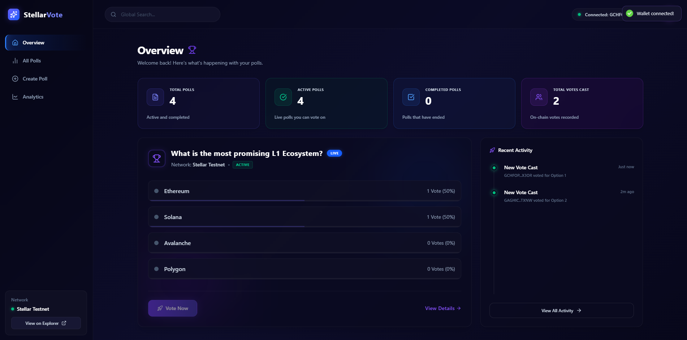
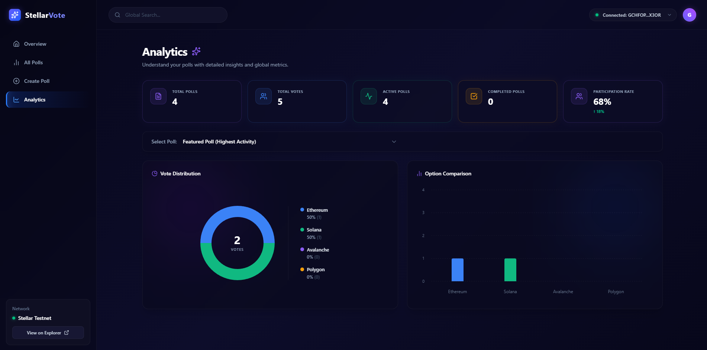
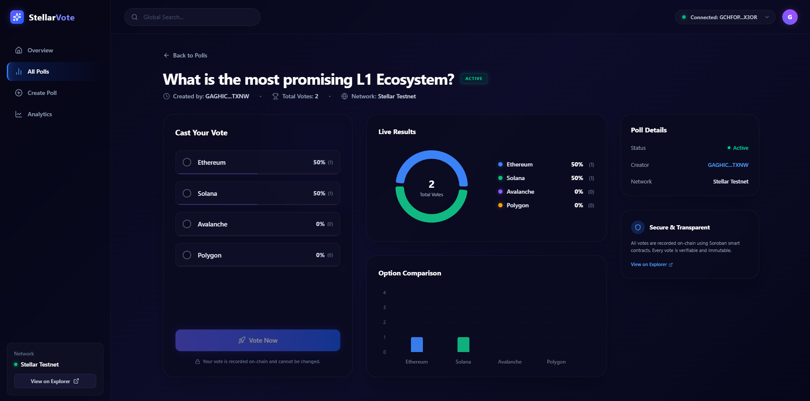
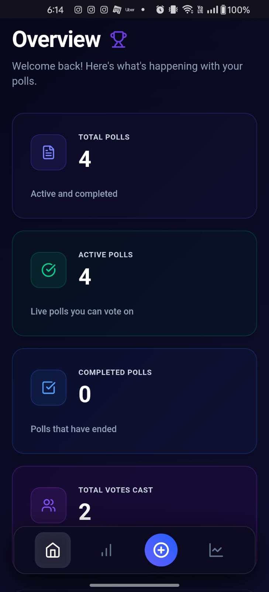

# StellarVote

A premium, multi-poll decentralized voting platform on the Stellar testnet with Soroban contract integration, real-time analytics, and a beautiful mobile-responsive glassmorphic dashboard.

## Live Demo

**Live App:** https://stellar-vote-frontend.vercel.app
**GitHub:** https://github.com/vanshdhiwar09/stellar-vote

---

## Features

- **Multi-Poll Architecture** — Anyone can create, deploy, and manage polls securely on-chain.
- **Smart Contract** — Log and query active/completed polls on the Soroban testnet natively.
- **Real-Time Analytics** — Live visualizations of vote distribution using Recharts directly from RPC states.
- **Transaction Status** — In-progress deployment monitors and Stellar Expert explorer receipts.
- **Error Handling** — Explicit captures for "Wallet not found", "User rejected signature", and "Invalid Options".
- **Responsive UI** — Ultra-modern, dark-themed glassmorphic design that scales flawlessly to mobile devices.

---

## Wallet Options




| Wallet | Type |
|--------|------|
| Freighter | Browser extension |

---

## Deployment Details

### Contract Address (Testnet)

```text
CDFT2ZWORT3CIWKCJX2B4XK7QWK63KKWWLV4L7MCN6MC2TLCHSGQLD2I
```

### Example Transaction Hash

```text
b634b1cb400d8c03ba57abbe4a9c0d4db04cb8507097309d912380db6d417983
```

**Verify on Stellar Explorer:**  
https://stellar.expert/explorer/testnet/tx/b634b1cb400d8c03ba57abbe4a9c0d4db04cb8507097309d912380db6d417983

---

## Tech Stack

| Layer | Technology |
|-------|------------|
| Frontend | React 19 + Vite |
| Language | Strict TypeScript |
| Blockchain | Stellar Soroban (Rust) |
| Wallets | @stellar/freighter-api v6+ |
| Styling | TailwindCSS v4 + Lucide React |

---

## Quick Start

### Prerequisites

- Node.js 20+
- A Stellar testnet wallet (Freighter)

### Web App Setup

```bash
# Clone the repository
git clone https://github.com/vanshdhiwar09/stellar-vote.git
cd stellar-vote

# Install workspace dependencies
npm install

# Compile Soroban Bindings & Boot Vite
npm run dev
```

App runs securely at **http://localhost:5173**

---

## Project Structure

```text
stellar-vote/
├── frontend/               # React 19 UI Context and Grid Layouts
├── contracts/              # Soroban Rust Voting Contract source code
├── packages/stellar_vote/  # Auto-generated TypeScript bindings for the contract
├── screenshots/            # Submission screenshots
└── README.md
```

---

## Configuration

If deploying to Vercel yourself, these are the environmental assignments needed:

### Frontend Variables

| Variable | Value |
|----------|--------|
| `VITE_CONTRACT_ID` | `CDFT2ZWORT3CIWKCJX2B4XK7QWK63KKWWLV4L7MCN6MC2TLCHSGQLD2I` |

*(This is safely injected locally via `frontend/.env`)*

### Vercel Project Setup (Monorepo)

| Project | Root Directory | Output Directory | Framework Preset |
|---------|----------------|------------------|------------------|
| Frontend | `(Blank)`      | `frontend/dist`  | `Other`          |

*(By omitting the Root Directory, Vercel accurately builds the `stellar_vote` internal workspace dependencies before bundling Vite).*

---

## Screenshots

### Dashboard & Analytics

*(Please place a screenshot of your main overview or analytics tab in `screenshots/dashboard.png`)*

### Poll Details & Voting

*(Please place a screenshot of a specific Poll showing the visual bars in `screenshots/voting.png`)*

### Mobile Responsiveness

*(Please place a screenshot of the site running on a mobile browser or mobile devtools in `screenshots/mobile.png`)*

---

## Level Requirements Met

| Requirement | Implementation |
|-------------|----------------|
| Live Event Handling | State re-hydration globally tracks incoming polls and updates vote aggregations |
| Contract on testnet | `CDFT2ZWORT3CIWKCJX2B4XK7QWK63KKWWLV4L7MCN6MC2TLCHSGQLD2I` |
| Contract interactions | `create_poll`, `vote`, `get_poll`, `get_all_polls` |
| Advanced Storage | Designed utilizing dynamic strictly-typed `Map<u32, PollData>` instances |
| Premium UX/UI | Fully responsive Tailwind grids, Recharts integrations, and Glassmorphic themes |

---

## License

MIT

**Built on Stellar**

🔗 [GitHub Repository](https://github.com/vanshdhiwar09/stellar-vote)
